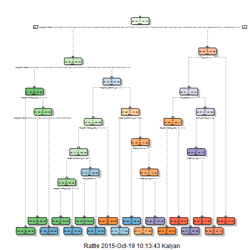

# Practical Machine Learning Project
#### Author : Kalyan Nandi
Using devices such as Jawbone Up, Nike FuelBand, and Fitbit it is now possible to collect a large amount of data about personal activity relatively inexpensively. These type of devices are part of the quantified self movement - a group of enthusiasts who take measurements about themselves regularly to improve their health, to find patterns in their behavior, or because they are tech geeks. One thing that people regularly do is quantify how much of a particular activity they do, but they rarely quantify how well they do it. In this project, your goal will be to use data from accelerometers on the belt, forearm, arm, and dumbell of 6 participants. They were asked to perform barbell lifts correctly and incorrectly in 5 different ways. More information is available from the website here: http://groupware.les.inf.puc-rio.br/har (see the section on the Weight Lifting Exercise Dataset).

## Modeling

In order to clean the dataset, the following steps where taken:

1.  Remove `#DIV/0!` and replace with `NA` values.
1.  Replace empty strings to `NA` values.

The primary code to preprocess the data is located [here](https://github.com/rimo0007/Practical-Machine-Learning).


## Cross Validation

Cross validation was achieved by splitting the training data into a test set and a training set using the following:
The data was partioned by the `classe` variable to ensure the training set and test set contain examples of each class. 60% of the training data was allocated
to the training set and the remainder for the validation set.

## Feature Selection
Now the next work is to explore the data and decide what would be the useful information. An important goal of any kind of model is to geralize well with the un seen data.  Given this,

#### STEP 1: Get the Data from the URL and Load the data into a data frame.

#### STEP 2: To Clean the Data first remove all NearZeroVariance variables from the training set.

#### STEP 3: Remove the first column of the myTraining data set because it is an  ID variable so that it does not interfer with ML MODEL.

#### STEP 4: Cleaning Variables with 80% or more NAs.  For Variables that have more than a 80% threshold of NA's I'm going to remove them.

#### STEP 5: select from validation of test set as well as new test set, only those columns  that you got after feature selection of  Training set.

#### STEP 6: Coerce the data into the same type so that Algorithm works properly and gives a good accuracy so, change all the column types of test data
        into the type of training data.


## Getting the data and  Remove `#DIV/0!` 


```r
library(knitr)
#Get the URL of the DATASET
trainUrl <- "http://d396qusza40orc.cloudfront.net/predmachlearn/pml-training.csv"
testUrl <- "http://d396qusza40orc.cloudfront.net/predmachlearn/pml-testing.csv"

training <- read.csv(url(trainUrl), na.strings=c("NA","#DIV/0!",""))
testing <- read.csv(url(testUrl), na.strings=c("NA","#DIV/0!",""))
set.seed(12345)
```

## Partioning the training set into two and remove all NearZeroVariance variables from the training set

## Partioning Training data set into two data sets, 60% for myTraining, 40% for myTesting:


```r
library(caret)
inTrain <- createDataPartition(y=training$classe, p=0.6, list=FALSE)
myTraining <- training[inTrain, ]
myTesting <- training[-inTrain, ]
#Cleaning the data 
#Remove NearZeroVariance variables from the training and test set both
nsv <- nearZeroVar(myTraining, saveMetrics=TRUE)
myTraining <- myTraining[,nsv$nzv==FALSE]

nsv<- nearZeroVar(myTesting,saveMetrics=TRUE)
```

## Remove the first column of the myTraining data set because it is a  ID variable so that it does not interfer with ML MODEL.


```r
myTraining <- myTraining[c(-1)]
```

## Cleaning Variables with 80% or more NAs. For Variables that have more than a 80% threshold of NA's I'm going to remove them.


```r
temp <- myTraining #creating another subset to iterate in loop
for(i in 1:length(myTraining)) { #for every column in the training dataset
  if( sum( is.na( myTraining[, i] ) ) /nrow(myTraining) >= .8 ) { #if n?? NAs > 80% of total observations
    for(j in 1:length(temp)) {
      if( length( grep(names(myTraining[i]), names(temp)[j]) ) ==1)  { #if the columns are the same:
        temp <- temp[ , -j] #Remove that column
      }   
    } 
  }
}
#To check the new N?? of observations
myTraining <- temp
```

## Take only those columns that you have taken for  Training set


```r
# I will take only those columns that I have taken for My Training set
myTesting <- myTesting[colnames(myTraining)]

col<- colnames(myTraining[, -58]) #Column name without class name
testing <- testing[col] 
```

## Coerce the data into the same type so that Algorithm works properly and gives a good accuracy so, change all the column types of test  data into the type of training data.


```r
for (i in 1:length(testing) ) {
  for(j in 1:length(myTraining)) {
    if( length( grep(names(myTraining[i]), names(testing)[j]) ) == 1)  {
      class(testing[j]) <- class(myTraining[i])
    }      
  }      
}

#And to make sure Coertion really worked just add a row of the training set to it and then delete it
testing <- rbind(myTraining[2, -58] , testing)
testing <- testing[-1,]
```

## Prediction with Decision Trees : Model 1


```r
library(rattle)
library(rpart)

modFitA1 <- rpart(classe ~ ., data=myTraining, method="class")
fancyRpartPlot(modFitA1)
```

 

```r
predictionsA1 <- predict(modFitA1, myTesting, type = "class")
cmtree <- confusionMatrix(predictionsA1, myTesting$classe)
```

## Prediction with Random Forests:  Model 2


```r
library(randomForest)
set.seed(12345)
modFitB1 <- randomForest(classe ~ ., data=myTraining)

##Predicting in-sample error 

predictionB1 <- predict(modFitB1, myTesting, type = "class")
cmrf <- confusionMatrix(predictionB1, myTesting$classe)
```

## Prediction with Generalized Boosted Regression : Model 3


```r
library(caret)
set.seed(12345)
fitControl <- trainControl(method = "repeatedcv",
                           number = 5,
                           repeats = 1)

gbmFit1 <- train(classe ~ ., data=myTraining, method = "gbm",
                 trControl = fitControl,
                 verbose = FALSE)


gbmFinMod1 <- gbmFit1$finalModel

gbmPredTest <- predict(gbmFit1, newdata=myTesting)
gbmAccuracyTest <- confusionMatrix(gbmPredTest, myTesting$classe)
```

## Predicting Results on the Test Data with Random Forest as Random Forest is giving more accuracy


```r
predictionB2 <- predict(modFitB1, testing, type = "class")

#This Function will write the file for submission
pml_write_files = function(x){
  n = length(x)
  for(i in 1:n){
    filename = paste0("problem_id_",i,".txt")
    write.table(x[i],file=filename,quote=FALSE,row.names=FALSE,col.names=FALSE)
  }
}

#pml_write_files(predictionB2)
```

## Conclusion

The random forest algorithm appears to perform very well for predicting activities from accelerometers measurements.
